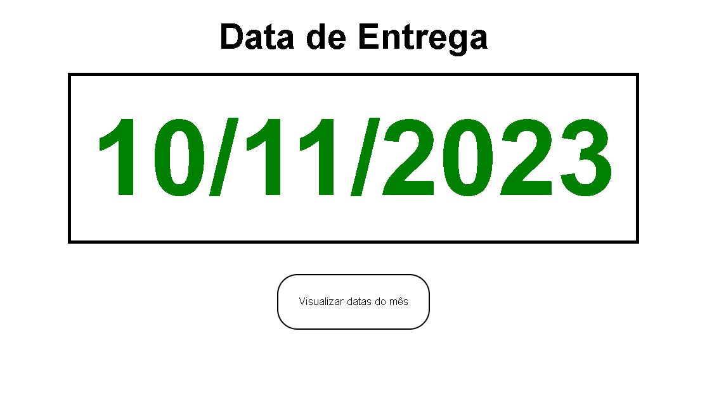
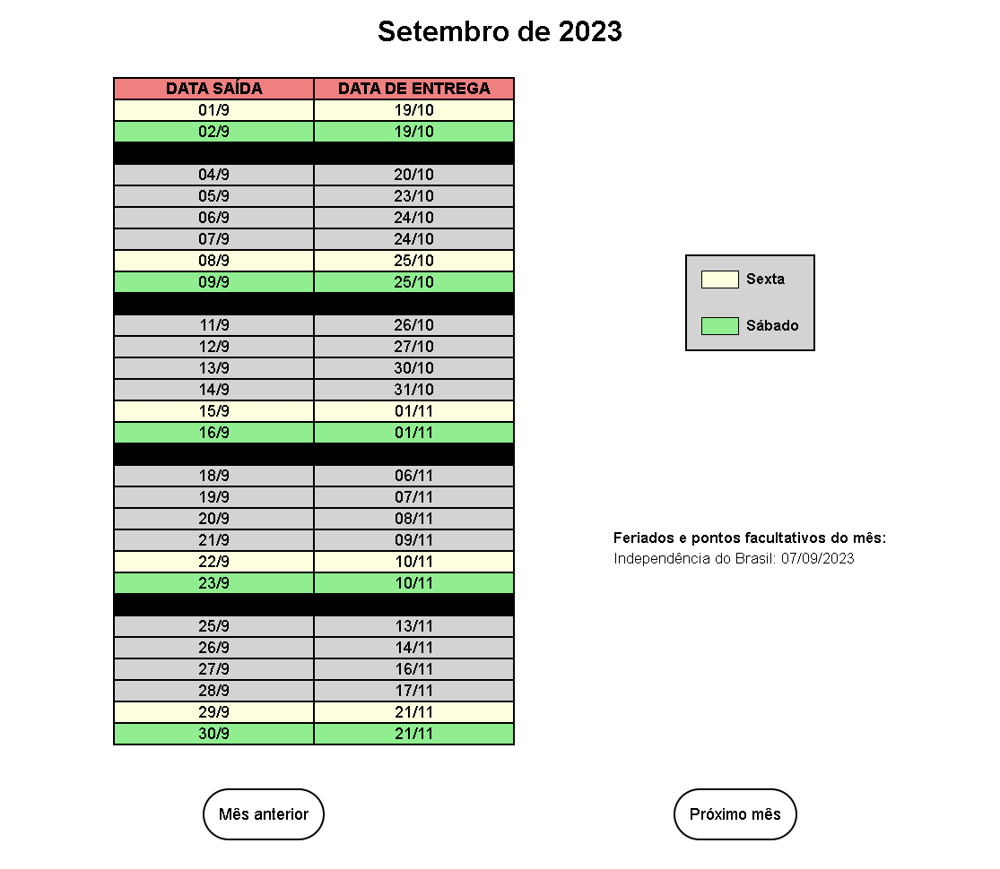
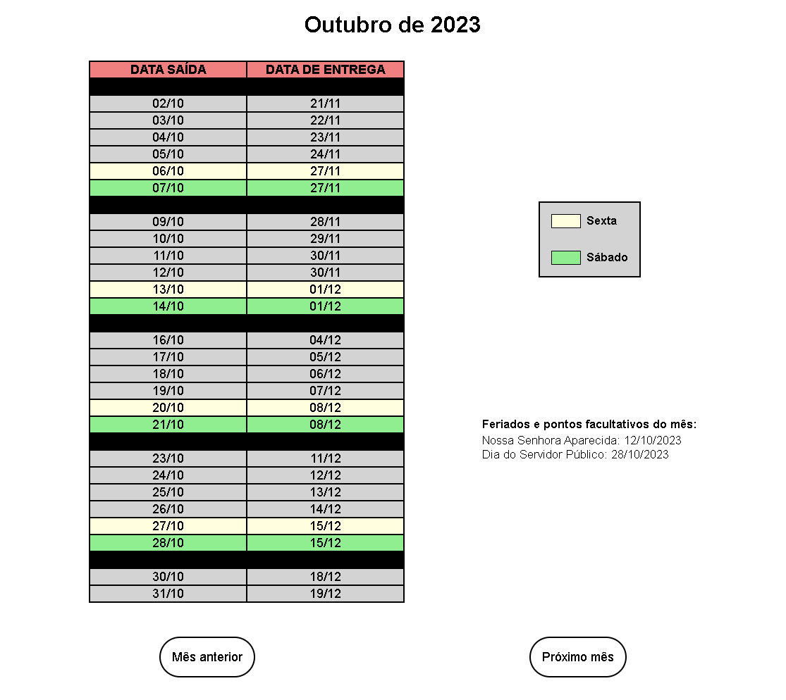

# Data de Entrega

Este é um programa responsável por realizar o cálculo da entrega de um produto, baseado em uma data fixa de dias úteis.

## Table of contents

- [Overview](#overview)
  - [Screenshot](#screenshot)
  - [Links](#links)
- [My process](#my-process)
  - [Built with](#built-with)
- [Author](#author)

## Overview

### Screenshot

- Tela Inicial do Programa (data do dia atual)

- Informações dos dias do mês atual

- Informações de outros meses

### Links

- Live Site URL: [Age Calculator App](https://leonardos1lva.github.io/data-entrega/)

## My process

### Built with

- HTML5
- CSS3
- Flexbox
- JavaScript

## Author

- Website - [Leonardo Silva](https://github.com/LeonardoS1lva)
- LinkedIn - [Leonardo Silva](https://www.linkedin.com/in/leonardos1lva/)
